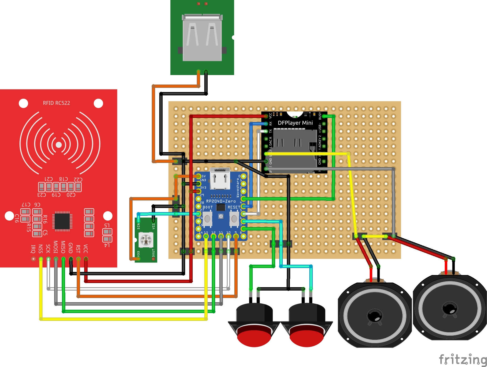
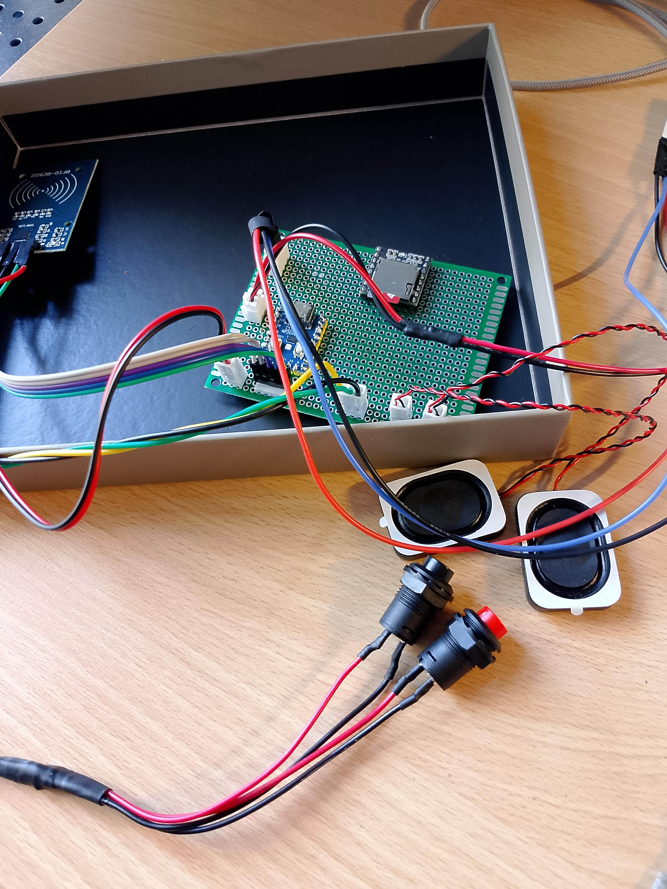
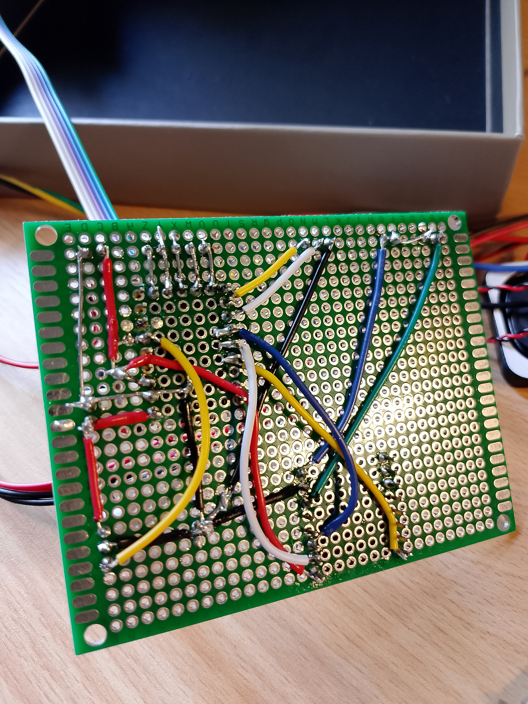

# tag-tune
An open-source, USB-powered audio player that brings physical objects to life.

## Table of Contents
1. [Components](#components)
2. [Wiring Diagram](#wiring-diagram)
3. [Firmware Details](#firmware-details)
4. [DFPlayer Mini & SD Card Setup](#dfplayer-mini--sd-card-setup)
5. [LED Status Indicators](#led-status-indicators)
6. [How to Use](#how-to-use)
7. [How to Build](#how-to-build)
    - [Breadboard Prototyping](#breadboard-prototyping)
    - [Firmware Setup](#firmware-setup)
    - [Important: USB Power Handling](#important-usb-power-handling)
    - [Build Prototype](#build-prototype)
8. [Support Me](#support-me)
9. [Third-Party Code and License](#third-party-code-and-license)

## Components
- RP2040 (Zero)
- DFPlayer Mini
- RC522 NFC reader
- USB Connector
- WS2812 (NeoPixel LED)
- 2 Speaker 3 Ohm 
- Micro SD Card
- Perfboard (5x7cm)
- Connectors / Cables
- Enclosure / Box

## Wiring Diagram

Figure 1: Wiring diagram on the perfboard

## Firmware Details
The firmware is written in **MicroPython** and utilizes a modified version of the [penguintutor/dfplayermini-pico](https://github.com/penguintutor/dfplayermini-pico) library.

## DFPlayer Mini & SD Card Setup
The DFPlayer Mini requires the SD card to be formatted to **FAT16 or FAT32**.

### SD Card Structure
The module requires a specific file naming convention to function reliably:
- **Folder naming:** Use a folder named `01` in the root directory.
- **File naming:** Files should be prefixed with a three-digit number (e.g., `001.mp3`).

## LED Status Indicators
The WS2812 LED (internal on PIN 16 and (optional) extenal on PIN 28) provides visual feedback on the system's state:

- **White:** System is initializing.
- **Green:** Ready and waiting for NFC tag.
- **Blue:** Valid tag and playing
- **Cyan:**  Finished playing on tag
- **Red:**: Error: No SD card or invalid tag

## How to use
Copy music or audio stories onto an SD card. Write tags as plain text — list the numbers of the files you want to play, separated by commas. You can use your smartphone to write the tags.
Example: 1,2,5 will play files 1, 2, and 5 from the SD card in that order.

When you remove and then present the same tag again, playback will resume from where it stopped. If you present a different tag, playback starts from the beginning of that playlist. You can also remove the tag to pause.

Use the buttons to go to the next or previous file (short press), or to adjust the volume up or down (long press).

Later you can glue the tags onto figures or other objects. Have fun with your music box :)

## How to build

### Breadboard Prototyping
For initial testing, it is recommended to build the circuit on a breadboard first as shown in the wiring diagram.

### Firmware Setup
1. Install **Thonny** IDE on your computer.
2. Flash the **MicroPython firmware** to the RP2040.  
   > **Firmware download:** [MicroPython for RP2040](https://micropython.org/download/rp2-pico/)
3. Copy all files from the `firmware` folder to the RP2040.

### Important: USB Power Handling
- **Do not** connect an external USB power source to the additional USB port while the RP2040 is connected to your computer via USB.
- Once the RP2040 is disconnected from the computer, the external USB port can be used to power all components. But for testing purpose you can use the USB Port of the RP2040.
- The external USB port will later be integrated into the enclosure.

### Build prototype
Solder the components and wires onto the perfboard as shown in Figure 1. Once the assembly is complete, perform an initial functional test before mounting the board into the enclosure.

to be done:
Drill the necessary holes for the cable glands and connectors, then insert them and secure with hot glue if necessary. The status LED was also routed through the lid for better visibility.

## Support me
If you find this project helpful and would like to support my work, I would be very grateful for a contribution via GitHub Sponsors or in Bitcoin (BTC) / Litecoin (LTC). Every bit of support helps me to keep creating and sharing new projects. Thank you!

### LTC:
ltc1qx2yf4cndqr2zf3vfd7l2ywm5hylvhm0a8jrxry

### BTC: 
bc1q5yga8eluxk7cn4pc7k36lwee06mwt5gtre8nrm

### Bitcoin Cash
bitcoincash:qp4gapsmpt75nh7clp64dhae2myhl9h8tg2f77w652

## Third-Party Code and License

This project contains modified code from the [penguintutor/dfplayermini-pico](https://github.com/penguintutor/dfplayermini-pico) repository.

*   **Original Author:** [@PenguinTutor](https://www.penguintutor.com)
*   **Original Repository License:** **GNU General Public License v3.0** (GPL-3.0) – see full text in the original repository's `LICENSE` file.
*   **Modifications by:** ([@simonbln](https://github.com/simonbln))
*   **Date of modifications:** March 2026
*   **Nature of modifications:**
    1.  Updated `command.to_bytes(1)` to `command.to_bytes(1, 'big')` for compatibility with newer Python versions.
    2.  Fixed the return value parsing for the reset command to correctly handle the module's response.

This modified version is distributed under the same license terms (GPL-3.0). The complete license text is included in this repository as `LICENSE`.
